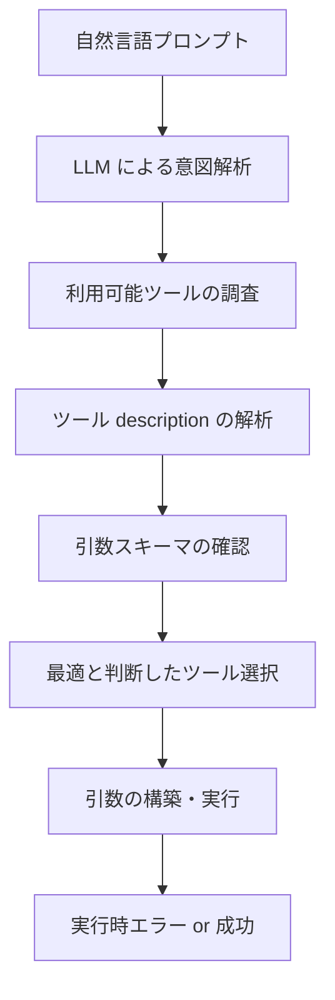

# LangChain ツール認識問題：技術的詳細と対策

## 概要

本文書は、LangChain を使用したツール呼び出しにおいて発生する認識問題について、技術的詳細と実用的な対策をまとめたものです。特に、今回の C# Function Calling システムで発見された問題を中心に分析しています。

## 1. LangChain ツール認識メカニズム

### 🧠 LLM によるツール選択プロセス



### 📊 情報参照の優先順位

1. **description（最重要）**: ツールの説明文・使用方法
2. **name**: ツール名からの機能推測
3. **parameter schema**: 引数の型定義・制約
4. **parameter descriptions**: 各引数の詳細説明

**重要**: LangChain は **型定義よりも description** を重視する傾向がある

## 2. 発見された問題の詳細分析

### 🚨 問題事例 1: 配列引数の誤認識

#### 発生状況
```
プロンプト: "次の10個の数を同時に処理してください: [12, 15, 18, ...]"
期待される動作: prime_factorization を10回個別に呼び出し
実際の動作: prime_factorization({'numbers': [12, 15, 18, ...]}) を1回呼び出し
```

#### エラーメッセージ
```
Tool execution error: Function execution failed: 
Missing number argument. Expected: 'number', 'n', 'num', 'value', or 'integer'. 
Received: numbers
```

#### 根本原因
1. **自然言語の曖昧性**: "同時に処理" = "一括処理"と LLM が解釈
2. **効率性の追求**: LLM が自動的に最適化を試みて仕様を逸脱
3. **型チェックの不備**: 実行時まで引数の妥当性が検証されない

### 🚨 問題事例 2: early_stopping_method エラー

#### 発生状況
```
複雑なテスト（複数関数呼び出し）の最終レスポンス生成時
エラー: Got unsupported early_stopping_method `generate`
```

#### 原因
- LangChain の新バージョンで非対応パラメータを使用
- 単純なテストでは問題なし、複雑な処理で発生

### 🚨 問題事例 3: 大きな数値の制限

#### 発生状況
```
プロンプト: "100の階乗を計算してください"
エラー: Factorial calculation overflow for numbers greater than 20
```

#### 原因
- C# 側で意図的に設けられた制限値（20以上の階乗は計算不可）
- LLM は数学的可能性のみ考慮し、実装制限を認識できない

## 3. LangChain ツール認識の構造的問題

### 🤖 LLM の推論パターン

#### 効率性優先の判断
```python
# LLM の思考プロセス（推測）
"10個の数を処理する" 
→ "10回呼び出すより1回で済ませる方が効率的"
→ "配列で渡せるはず"
→ {'numbers': [配列]} で呼び出し
```

#### 自然言語優先の解釈
```python
# 技術仕様 vs 自然言語の優先度
型定義: {"number": {"type": "integer"}}  # 技術的制約
description: "数値を処理する"             # 自然言語説明
プロンプト: "同時に処理"                  # 自然言語指示

→ LLM は自然言語の論理を優先
```

### ⚡ 実行時検証の限界

#### 計画時 vs 実行時
```python
# 計画時（型チェックなし）
LLM: "prime_factorization({'numbers': [...]})" を計画

# 実行時（型チェック実施）
Tool: TypeError - 'numbers' argument not found
```

#### 問題点
- **遅延エラー**: 問題が実行まで発覚しない
- **リソース浪費**: 不正な引数での無駄な API 呼び出し
- **デバッグ困難**: エラー原因の特定に時間がかかる

## 4. 対策と推奨プラクティス

### 🛡️ Description の強化

#### 改善前
```python
{
    "name": "prime_factorization",
    "description": "Perform prime factorization of a number",
    "parameters": {
        "type": "object", 
        "properties": {
            "number": {"type": "integer", "description": "Number to factorize"}
        },
        "required": ["number"]
    }
}
```

#### 改善後
```python
{
    "name": "prime_factorization", 
    "description": """
    Perform prime factorization of a SINGLE integer only.
    
    IMPORTANT CONSTRAINTS:
    - Cannot process arrays or multiple numbers simultaneously
    - Must be called once per number for multiple factorizations
    - Input must be a positive integer greater than 1
    - Maximum supported value: 1,000,000
    
    USAGE EXAMPLES:
    - Correct: prime_factorization(12) → [2, 2, 3]
    - WRONG: prime_factorization([12, 15, 18]) → Error
    
    For multiple numbers, call this function multiple times.
    """,
    "parameters": {
        "type": "object",
        "properties": {
            "number": {
                "type": "integer",
                "minimum": 2,
                "maximum": 1000000,
                "description": "Single positive integer to factorize (2-1,000,000)"
            }
        },
        "required": ["number"]
    }
}
```

### 🎯 制約の明示化

#### 物理的制約の記載
```python
{
    "name": "factorial",
    "description": """
    Calculate factorial of a positive integer.
    
    COMPUTATIONAL LIMITS:
    - Maximum input: 20 (due to overflow protection)
    - For n > 20: Use external calculation tools
    - Result type: 64-bit integer (max ~9 × 10^18)
    
    ERROR HANDLING:
    - n > 20: Returns error message about overflow
    - n < 0: Returns error message about invalid input
    - n = 0: Returns 1 (mathematical definition)
    """,
    "parameters": {
        "type": "object",
        "properties": {
            "n": {
                "type": "integer",
                "minimum": 0,
                "maximum": 20,
                "description": "Non-negative integer (0-20 only)"
            }
        },
        "required": ["n"]
    }
}
```

#### 使用例の明示
```python
{
    "name": "measure_voltage",
    "description": """
    Measure DC voltage with specified parameters.
    
    PARAMETER CONSTRAINTS:
    - range: Must be exact string from ['AUTO', '100mV', '1V', '10V', '100V']
    - integration_time: 0.001-100.0 seconds (longer = higher precision)
    - Cannot measure AC voltage (use measure_ac_voltage instead)
    
    USAGE EXAMPLES:
    - High precision: measure_voltage(range='100mV', integration_time=10.0)
    - Fast measurement: measure_voltage(range='AUTO', integration_time=0.1)
    
    IMPORTANT: Requires 10-second warm-up before first measurement.
    """,
    "parameters": {
        "type": "object",
        "properties": {
            "range": {
                "type": "string",
                "enum": ["AUTO", "100mV", "1V", "10V", "100V"],
                "description": "Measurement range - use exact string values only"
            },
            "integration_time": {
                "type": "number",
                "minimum": 0.001,
                "maximum": 100.0,
                "description": "Integration time in seconds (longer = more precise)"
            }
        },
        "required": ["range", "integration_time"]
    }
}
```

### 🔍 事前検証の実装

#### プロンプト解析による事前警告
```python
def analyze_prompt_for_potential_issues(prompt: str, available_tools: List[str]) -> List[str]:
    """プロンプトを解析して潜在的な問題を検出"""
    warnings = []
    
    # 配列処理の兆候を検出
    array_indicators = ["同時に", "一度に", "まとめて", "複数の", "リスト", "配列"]
    if any(indicator in prompt for indicator in array_indicators):
        single_item_tools = ["prime_factorization", "factorial", "is_prime"]
        mentioned_tools = [tool for tool in single_item_tools if tool in available_tools]
        if mentioned_tools:
            warnings.append(
                f"Warning: '{prompt}' contains batch processing keywords, "
                f"but {mentioned_tools} only accept single values. "
                f"Multiple calls may be required."
            )
    
    # 大きな数値の検出
    import re
    large_numbers = re.findall(r'\b([1-9]\d{2,})\b', prompt)
    if large_numbers:
        for num in large_numbers:
            if int(num) > 20 and "factorial" in prompt.lower():
                warnings.append(
                    f"Warning: factorial({num}) exceeds maximum limit (20). "
                    f"This will result in an overflow error."
                )
    
    return warnings
```

#### 引数妥当性の事前チェック
```python
def validate_tool_arguments(tool_name: str, arguments: Dict[str, Any]) -> Tuple[bool, str]:
    """ツール実行前の引数妥当性チェック"""
    
    # ツール固有の検証ルール
    validation_rules = {
        "prime_factorization": {
            "required_args": ["number"],
            "forbidden_args": ["numbers", "list", "array"],
            "type_checks": {"number": int},
            "range_checks": {"number": (2, 1000000)}
        },
        "factorial": {
            "required_args": ["n"],
            "type_checks": {"n": int},
            "range_checks": {"n": (0, 20)}
        }
    }
    
    if tool_name not in validation_rules:
        return True, "No validation rules defined"
    
    rules = validation_rules[tool_name]
    
    # 必須引数チェック
    for req_arg in rules["required_args"]:
        if req_arg not in arguments:
            return False, f"Missing required argument: {req_arg}"
    
    # 禁止引数チェック
    for forbidden_arg in rules.get("forbidden_args", []):
        if forbidden_arg in arguments:
            return False, f"Forbidden argument detected: {forbidden_arg}. Use {rules['required_args'][0]} instead."
    
    # 型チェック
    for arg, expected_type in rules.get("type_checks", {}).items():
        if arg in arguments and not isinstance(arguments[arg], expected_type):
            return False, f"Invalid type for {arg}: expected {expected_type.__name__}"
    
    # 範囲チェック
    for arg, (min_val, max_val) in rules.get("range_checks", {}).items():
        if arg in arguments:
            if not (min_val <= arguments[arg] <= max_val):
                return False, f"Value out of range for {arg}: {arguments[arg]} (allowed: {min_val}-{max_val})"
    
    return True, "OK"
```

### 🔄 フォールバック機構

#### 自動修正の試行
```python
def attempt_argument_correction(tool_name: str, arguments: Dict[str, Any]) -> Dict[str, Any]:
    """よくある引数エラーの自動修正を試行"""
    
    corrected = arguments.copy()
    
    # prime_factorization の配列→単一値修正
    if tool_name == "prime_factorization":
        if "numbers" in corrected and isinstance(corrected["numbers"], list):
            if len(corrected["numbers"]) == 1:
                corrected["number"] = corrected["numbers"][0]
                del corrected["numbers"]
                logger.info("自動修正: 'numbers' → 'number' (単一要素配列)")
    
    # 一般的な引数名の標準化
    arg_mappings = {
        "prime_factorization": {"n": "number", "num": "number", "value": "number"},
        "factorial": {"number": "n", "num": "n", "value": "n"}
    }
    
    if tool_name in arg_mappings:
        for old_name, new_name in arg_mappings[tool_name].items():
            if old_name in corrected and new_name not in corrected:
                corrected[new_name] = corrected[old_name]
                del corrected[old_name]
                logger.info(f"自動修正: '{old_name}' → '{new_name}'")
    
    return corrected
```

#### エラー回復の戦略
```python
class RobustToolExecutor:
    def __init__(self):
        self.max_retry_count = 3
        self.correction_history = []
    
    def execute_tool_with_recovery(self, tool_name: str, arguments: Dict[str, Any]):
        """エラー回復機能付きツール実行"""
        
        for attempt in range(self.max_retry_count):
            try:
                # 1. 事前検証
                is_valid, error_msg = validate_tool_arguments(tool_name, arguments)
                if not is_valid:
                    logger.warning(f"Attempt {attempt + 1}: {error_msg}")
                    
                    # 2. 自動修正を試行
                    corrected_args = attempt_argument_correction(tool_name, arguments)
                    if corrected_args != arguments:
                        arguments = corrected_args
                        continue
                    else:
                        raise ValueError(error_msg)
                
                # 3. ツール実行
                result = self.execute_tool(tool_name, arguments)
                logger.info(f"Tool execution successful on attempt {attempt + 1}")
                return result
                
            except Exception as e:
                logger.error(f"Attempt {attempt + 1} failed: {e}")
                
                if attempt == self.max_retry_count - 1:
                    # 最終試行失敗時はフォールバック
                    return self.fallback_execution(tool_name, arguments, e)
                
                # 次の試行のための引数調整
                arguments = self.adjust_arguments_for_retry(tool_name, arguments, e)
    
    def fallback_execution(self, tool_name: str, arguments: Dict[str, Any], error: Exception):
        """フォールバック実行（人間への移譲等）"""
        return {
            "error": f"Tool execution failed after {self.max_retry_count} attempts",
            "last_error": str(error),
            "suggested_action": "Please execute this operation manually",
            "tool_name": tool_name,
            "attempted_arguments": arguments
        }
```

## 5. プロンプト設計のベストプラクティス

### 📝 効果的なプロンプト設計

#### 誤解を招きやすい表現の回避
```python
# ❌ 問題のある表現
"次の数値を同時に処理してください: [12, 15, 18]"
"一度にすべての値を計算してください"
"効率的に処理してください"

# ✅ 推奨表現
"次の数値をそれぞれ個別に処理してください: 12, 15, 18"
"各値について順次計算してください"
"以下の手順で実行してください: 1) 12を処理, 2) 15を処理, 3) 18を処理"
```

#### 制約の明示
```python
# ✅ 制約を明示したプロンプト
prompt_template = """
以下の数値の素因数分解を行ってください: {numbers}

重要な制約:
- prime_factorization関数は一度に1つの数値のみ処理可能
- 各数値について個別に関数を呼び出してください
- 結果は各数値ごとに記録してください

処理する数値: {', '.join(map(str, numbers))}
"""
```

### 🎯 システムプロンプトの活用

#### ツール使用ガイドライン
```python
SYSTEM_PROMPT = """
あなたは数学計算を行うアシスタントです。以下のガイドラインに従ってください:

## ツール使用の原則
1. 各ツールは設計された用途でのみ使用してください
2. 配列処理が必要な場合は、個別の関数呼び出しを繰り返してください
3. エラーが発生した場合は、引数の形式を確認してください

## 特定ツールの注意事項
- prime_factorization: 単一の整数のみ。配列は不可
- factorial: 0-20の範囲のみ。大きな数値は制限あり
- measure_voltage: 正確な文字列値が必要（'AUTO', '100mV' など）

## エラー時の対応
1. 引数名の確認（number vs numbers, n vs num など）
2. 引数の型確認（整数 vs 配列）
3. 値の範囲確認（制限値以内か）

効率性よりも正確性を優先してください。
"""
```

### 🔍 デバッグ支援の強化

#### 詳細ログの実装
```python
import logging
from functools import wraps

def log_tool_execution(func):
    """ツール実行の詳細ログ"""
    @wraps(func)
    def wrapper(*args, **kwargs):
        logger.info(f"Tool execution start: {func.__name__}")
        logger.info(f"Arguments: args={args}, kwargs={kwargs}")
        
        try:
            result = func(*args, **kwargs)
            logger.info(f"Tool execution success: {result}")
            return result
        except Exception as e:
            logger.error(f"Tool execution failed: {e}")
            logger.error(f"Error type: {type(e).__name__}")
            raise
    
    return wrapper

# 使用例
@log_tool_execution
def prime_factorization(number: int) -> List[int]:
    """素因数分解（ログ付き）"""
    # 実装...
```

#### ステップバイステップ実行
```python
class DebugToolExecutor:
    def __init__(self, debug_mode: bool = False):
        self.debug_mode = debug_mode
        self.execution_steps = []
    
    def execute_with_debug(self, tool_name: str, arguments: Dict[str, Any]):
        """デバッグ情報付きツール実行"""
        
        step = {
            "timestamp": datetime.now().isoformat(),
            "tool_name": tool_name,
            "arguments": arguments,
            "step_number": len(self.execution_steps) + 1
        }
        
        if self.debug_mode:
            print(f"Step {step['step_number']}: Executing {tool_name}")
            print(f"Arguments: {arguments}")
            
            # 引数妥当性の確認
            is_valid, validation_msg = validate_tool_arguments(tool_name, arguments)
            print(f"Validation: {validation_msg}")
            
            if not is_valid:
                step["validation_error"] = validation_msg
                self.execution_steps.append(step)
                raise ValueError(f"Validation failed: {validation_msg}")
        
        try:
            result = self.execute_tool(tool_name, arguments)
            step["result"] = result
            step["status"] = "success"
            
            if self.debug_mode:
                print(f"Result: {result}")
                
        except Exception as e:
            step["error"] = str(e)
            step["status"] = "error"
            
            if self.debug_mode:
                print(f"Error: {e}")
            
            raise
        
        finally:
            self.execution_steps.append(step)
        
        return result
    
    def get_execution_summary(self):
        """実行サマリーの生成"""
        summary = {
            "total_steps": len(self.execution_steps),
            "successful_steps": len([s for s in self.execution_steps if s.get("status") == "success"]),
            "failed_steps": len([s for s in self.execution_steps if s.get("status") == "error"]),
            "steps": self.execution_steps
        }
        return summary
```

## 6. 継続的改善のアプローチ

### 📊 問題パターンの分析

#### エラーパターンの収集
```python
class ErrorPatternAnalyzer:
    def __init__(self):
        self.error_patterns = []
    
    def record_error(self, tool_name: str, arguments: Dict[str, Any], error: Exception, prompt: str):
        """エラーパターンの記録"""
        pattern = {
            "timestamp": datetime.now().isoformat(),
            "tool_name": tool_name,
            "arguments": arguments,
            "error_type": type(error).__name__,
            "error_message": str(error),
            "original_prompt": prompt,
            "error_category": self.categorize_error(error)
        }
        self.error_patterns.append(pattern)
    
    def categorize_error(self, error: Exception) -> str:
        """エラーカテゴリの分類"""
        error_msg = str(error).lower()
        
        if "missing" in error_msg and "argument" in error_msg:
            return "missing_argument"
        elif "expected" in error_msg and "received" in error_msg:
            return "argument_name_mismatch"
        elif "overflow" in error_msg:
            return "value_overflow"
        elif "out of range" in error_msg:
            return "value_out_of_range"
        else:
            return "unknown"
    
    def analyze_patterns(self) -> Dict[str, Any]:
        """エラーパターンの分析"""
        if not self.error_patterns:
            return {"message": "No error patterns recorded"}
        
        # カテゴリ別集計
        category_counts = {}
        for pattern in self.error_patterns:
            category = pattern["error_category"]
            category_counts[category] = category_counts.get(category, 0) + 1
        
        # 頻発ツール
        tool_counts = {}
        for pattern in self.error_patterns:
            tool = pattern["tool_name"]
            tool_counts[tool] = tool_counts.get(tool, 0) + 1
        
        # 推奨改善策
        recommendations = self.generate_recommendations(category_counts, tool_counts)
        
        return {
            "total_errors": len(self.error_patterns),
            "error_categories": category_counts,
            "problematic_tools": tool_counts,
            "recommendations": recommendations
        }
    
    def generate_recommendations(self, categories: Dict[str, int], tools: Dict[str, int]) -> List[str]:
        """改善推奨事項の生成"""
        recommendations = []
        
        # 引数名不一致が多い場合
        if categories.get("argument_name_mismatch", 0) > 2:
            recommendations.append(
                "Consider implementing automatic argument name mapping for common variations"
            )
        
        # 値オーバーフローが多い場合
        if categories.get("value_overflow", 0) > 1:
            recommendations.append(
                "Add clearer documentation about value limits in tool descriptions"
            )
        
        # 特定ツールでエラーが集中している場合
        max_tool_errors = max(tools.values()) if tools else 0
        if max_tool_errors > 3:
            problematic_tool = max(tools, key=tools.get)
            recommendations.append(
                f"Review and improve description for frequently failing tool: {problematic_tool}"
            )
        
        return recommendations
```

### 🔄 自動改善機能

#### Description の動的更新
```python
class AdaptiveToolDescriptionManager:
    def __init__(self):
        self.base_descriptions = {}  # 基本 description
        self.error_feedback = {}     # エラーフィードバック
    
    def update_description_based_on_errors(self, tool_name: str, error_patterns: List[Dict]):
        """エラーパターンに基づく description の自動更新"""
        
        if tool_name not in self.base_descriptions:
            return
        
        current_desc = self.base_descriptions[tool_name]
        additional_warnings = []
        
        # よくあるエラーパターンに基づく警告追加
        for pattern in error_patterns:
            if pattern["error_category"] == "argument_name_mismatch":
                if "numbers" in pattern["arguments"]:
                    additional_warnings.append(
                        "⚠️ COMMON MISTAKE: Do not use 'numbers' parameter. Use 'number' for single values only."
                    )
            
            elif pattern["error_category"] == "value_overflow":
                if "factorial" in tool_name:
                    additional_warnings.append(
                        "⚠️ OVERFLOW WARNING: Values > 20 will cause overflow errors. Use external tools for large factorials."
                    )
        
        # 警告を追加した新しい description
        if additional_warnings:
            enhanced_desc = current_desc + "\n\n" + "\n".join(additional_warnings)
            self.base_descriptions[tool_name] = enhanced_desc
            
            logger.info(f"Updated description for {tool_name} based on error patterns")
```

### 📈 品質メトリクスの監視

#### 成功率の追跡
```python
class ToolExecutionMetrics:
    def __init__(self):
        self.execution_history = []
    
    def record_execution(self, tool_name: str, arguments: Dict, success: bool, execution_time: float):
        """実行結果の記録"""
        record = {
            "timestamp": datetime.now().isoformat(),
            "tool_name": tool_name,
            "success": success,
            "execution_time": execution_time,
            "argument_count": len(arguments)
        }
        self.execution_history.append(record)
    
    def calculate_success_rate(self, tool_name: str = None, time_window_hours: int = 24) -> float:
        """成功率の計算"""
        cutoff_time = datetime.now() - timedelta(hours=time_window_hours)
        
        filtered_records = [
            r for r in self.execution_history
            if (tool_name is None or r["tool_name"] == tool_name) and
               datetime.fromisoformat(r["timestamp"]) >= cutoff_time
        ]
        
        if not filtered_records:
            return 0.0
        
        successful = len([r for r in filtered_records if r["success"]])
        return successful / len(filtered_records) * 100
    
    def get_performance_report(self) -> Dict[str, Any]:
        """パフォーマンスレポートの生成"""
        # ツール別成功率
        tool_success_rates = {}
        unique_tools = set(r["tool_name"] for r in self.execution_history)
        
        for tool in unique_tools:
            tool_success_rates[tool] = self.calculate_success_rate(tool)
        
        # 全体統計
        total_executions = len(self.execution_history)
        successful_executions = len([r for r in self.execution_history if r["success"]])
        overall_success_rate = (successful_executions / total_executions * 100) if total_executions > 0 else 0
        
        # 平均実行時間
        execution_times = [r["execution_time"] for r in self.execution_history if r["success"]]
        avg_execution_time = sum(execution_times) / len(execution_times) if execution_times else 0
        
        return {
            "overall_success_rate": overall_success_rate,
            "total_executions": total_executions,
            "successful_executions": successful_executions,
            "average_execution_time": avg_execution_time,
            "tool_success_rates": tool_success_rates,
            "report_timestamp": datetime.now().isoformat()
        }
```

## 7. 結論・推奨事項

### 🎯 重要なポイント

1. **Description が最重要**: 型定義よりも詳細で制約的な説明文が効果的
2. **自然言語の曖昧性**: "同時処理"等の表現は LLM に誤解を与えやすい
3. **事前検証の必要性**: 実行前の引数妥当性チェックが重要
4. **継続的改善**: エラーパターンの分析と description の動的更新

### 📋 実装チェックリスト

#### ツール定義の改善
- [ ] Description に制約・制限を明記
- [ ] 使用例と NG 例を記載
- [ ] 引数の型・範囲制限を詳述
- [ ] よくある間違いへの警告を追加

#### 検証機構の実装
- [ ] 事前引数妥当性チェック
- [ ] 自動引数修正機能
- [ ] エラー回復・フォールバック機能
- [ ] 詳細ログ・デバッグ機能

#### 監視・改善体制
- [ ] エラーパターンの自動収集
- [ ] 成功率・パフォーマンス監視
- [ ] Description の動的更新機能
- [ ] 定期的な品質レビュー

### 🔮 今後の課題

1. **LangChain の進化への対応**: 新バージョンでの仕様変更への継続的対応
2. **より高度な検証**: 意味的妥当性チェックの実装
3. **学習機能の追加**: 過去のエラーパターンからの自動学習
4. **多言語対応**: 日本語・英語混在環境での最適化

この文書に示された対策により、LangChain ツール認識問題の多くは回避可能ですが、LLM の本質的な非決定性は残るため、適切な監視・検証体制の構築が継続的に重要です。